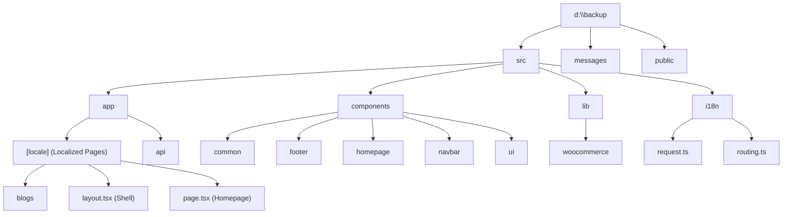

# Project Context: MPS Remastered (Marine Part System)

This document provides a comprehensive, structured overview of the `belikeabhayx/MPS-Remastered` headless storefront. It maps the codebase structure, tech stack, data flows, routing conventions, localization layout, and current development state to prevent future context loss.

> [!NOTE]
> This project is a highly-optimized, localized Next.js 16 storefront communicating with a WooCommerce & WordPress REST API backend to supply genuine, used, and aftermarket marine parts globally.

---

## 🛠️ Tech Stack & Key Dependencies

| Technology / Library | Version | Purpose |
| :--- | :--- | :--- |
| **Next.js** | `16.2.3` | Framework (App Router under `src/app/[locale]`) |
| **React** | `19.2.4` | Component UI library (supporting Server & Client Components) |
| **next-intl** | `^4.9.1` | Internationalization & routing middleware wrapper |
| **Tailwind CSS** | `^4` | Styling system using `@tailwindcss/postcss` config |
| **shadcn/ui** | `^4.2.0` | Radix-based UI components (`button`, `card`, `select`, etc.) |
| **sanitize-html** | `^2.17.2` | HTML sanitization for rendering WooCommerce description fields |
| **node-html-parser** | `^7.1.0` | Server-side HTML parsing for blog layouts and Table of Contents |

---

## 📁 Repository Directory Structure



### Key Directories Map

*   **`messages/`**: Locale files (`en.json`, `es.json`, `de.json`, `nl.json`) holding localized string assets.
*   **`src/app/[locale]/`**: Standard localized App Router route structure for next-intl.
    *   `layout.tsx`: Main shell setup, loading custom local Satoshi font along with Inter and Noto Serif Google Fonts. Wraps layout with `NextIntlClientProvider`.
    *   `page.tsx`: Homepage that renders the main hero section and categories view.
    *   `blogs/page.tsx` & `[slug]/page.tsx`: Full headless WordPress blog integration with support for SEO redirects and slug conversions.
*   **`src/app/api/`**: Next.js Server Route Handlers.
    *   `api/translated-blog-slug/route.ts`: Resolves language-specific blog post slugs dynamically using WordPress REST API and the WPML `include[]` parameter.
*   **`src/components/`**: Modular layout, UI, and business logic components.
    *   `homepage/PartsFinder.tsx`: Cascading multi-select search widget (Brand -> Category -> Engine -> Part).
    *   `LanguageSwitcher.tsx`: Navbar drop-down for locale switching.
    *   `common/SanitizedHTML.tsx`: Helper component rendering server-side/client-side sanitized HTML safely.
*   **`src/lib/`**: Utilities and backend API fetchers.
    *   `lib/woocommerce/`: Core WooCommerce client helper.
        *   `config.ts`: Endpoint configuration. Contains `WC_API_BASE` (`/wp-json/wc/v3`) and `getWcAuthHeader()` (Basic Auth credentials encoder).
        *   `auth.ts`: Provides general credential generation headers.
        *   `brands.ts`: Asynchronously retrieves product brands (`/products/brands`) recursively with auto-pagination and custom language parameter filters (`wpml_language`).
        *   `blogs.ts`: WordPress Post REST API fetcher (`/wp-json/wp/v2/posts`) supporting pagination and translation slug fetches.

---

## 🌐 Localization & Custom Routing (next-intl)

The site supports four primary locales: **English (`en`)**, **Spanish (`es`)**, **German (`de`)**, and **Dutch (`nl`)**.

*   **Middleware (`src/proxy.ts`)**: Serves next-intl middleware for route routing.
*   **Routing Config (`src/i18n/routing.ts`)**: Defines localized paths dynamically:
    ```ts
    locales: ["en", "es", "de", "nl"],
    defaultLocale: "en",
    localePrefix: "as-needed", // Hides the locale prefix for default language 'en'
    pathnames: {
      "/product-category": {
        en: "/product-category",
        es: "/categoria-producto",
        de: "/produkt-kategorie",
        nl: "/product-categorie",
      },
      ...
    }
    ```
*   **Message Loading (`src/i18n/request.ts`)**: Dynamically resolves language messages bundle (`messages/[locale].json`) upon incoming server requests.

---

## 🔐 Environment Configuration (`.env`)

The storefront communicates directly with a WordPress/WooCommerce staging/production backend:
*   `NEXT_PUBLIC_WOOCOMMERCE_URL` or `WOOCOMMERCE_URL`: `https://mps.digital-monkey.in/`
*   `WOOCOMMERCE_CONSUMER_KEY`: `ck_2da...`
*   `WOOCOMMERCE_CONSUMER_SECRET`: `cs_9b6...`

---

## 🚨 Current Compilation Error & Code Status

### 1. `bun run dev` crash
The server currently crashes with a React stream exception and script exit code `58`/`1`. 
This is caused by a syntax/compile error in `src/components/homepage/PartsFinder.tsx`:

> [!WARNING]
> **Issue in `PartsFinder.tsx`**:
> On line 47, the component attempts to map over `brands`:
> ```tsx
> {brands?.map((brand: Brand) => ( ... ))}
> ```
> However, `brands` is **never imported, passed as a prop, or declared as state** in `PartsFinder.tsx`. This causes a runtime/compile crash because `brands` is not in scope.

### 2. Localization Namespace Miss in `PartsFinder.tsx`
*   The component imports translations with:
    ```tsx
    const t = useTranslations("home");
    ```
    However, the parts-finder labels in `messages/en.json` are situated at the **top level** namespace `"partsFinder"` instead of `"home.partsFinder"`.
*   **Corrective Action**:
    ```tsx
    const t = useTranslations("partsFinder");
    // Or load both "home" and "partsFinder" separately if hero text is also required.
    ```

---

## ⚙️ Development Commands

Use the following commands inside `d:\backup`:
*   **Run Dev Server**: `bun run dev`
*   **Build Production Bundle**: `bun run build`
*   **Lint Check**: `bun run lint`
